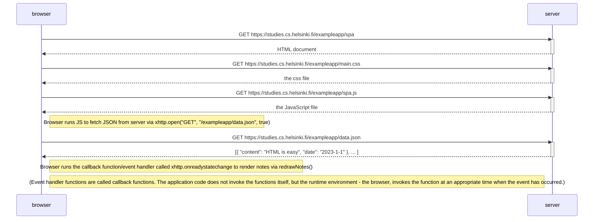

```mermaid
sequenceDiagram
    participant browser
    participant server

    browser->>server: GET https://studies.cs.helsinki.fi/exampleapp/spa
    activate server
    server-->>browser: HTML document
    deactivate server

    browser->>server: GET https://studies.cs.helsinki.fi/exampleapp/main.css
    activate server
    server-->>browser: the css file
    deactivate server

    browser->>server: GET https://studies.cs.helsinki.fi/exampleapp/spa.js
    activate server
    server-->>browser: the JavaScript file
    deactivate server

    Note right of browser: Browser runs JS to fetch JSON from server via xhttp.open("GET", "/exampleapp/data.json", true)

    browser->>server: GET https://studies.cs.helsinki.fi/exampleapp/data.json
    activate server
    server-->>browser: [{ "content": "HTML is easy", "date": "2023-1-1" }, ... ]
    deactivate server

    Note right of browser: Browser runs the callback function/event handler called xhttp.onreadystatechange to render notes via redrawNotes()
    Note right of browser: (Event handler functions are called callback functions. The application code does not invoke the functions itself, but the runtime environment - the browser, invokes the function at an appropriate time when the event has occurred.)
    
```