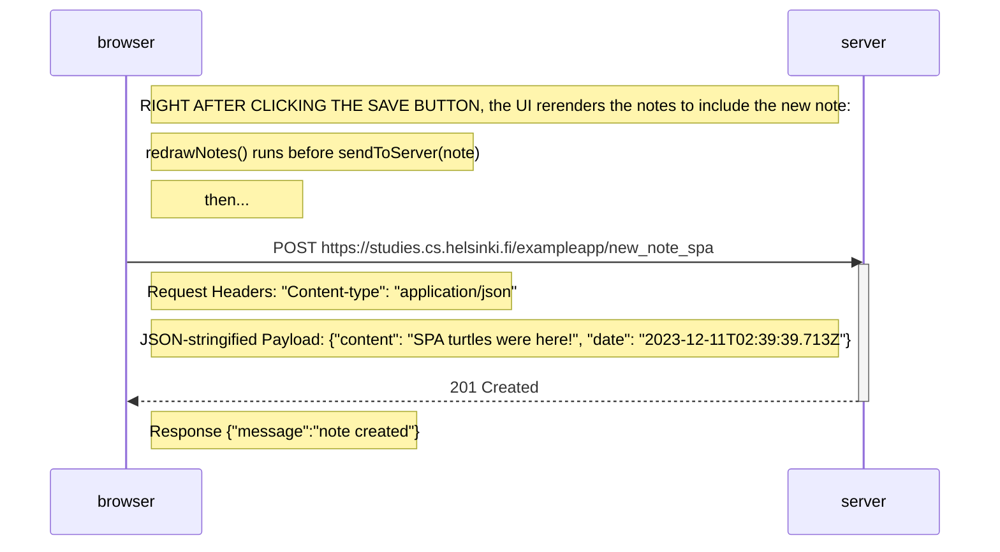

```mermaid
sequenceDiagram
    participant browser
    participant server

    Note right of browser: RIGHT AFTER CLICKING THE SAVE BUTTON, the UI rerenders the notes to include the new note:
    Note right of browser: redrawNotes() runs before sendToServer(note)

    Note right of browser: then...
    browser->>server: POST https://studies.cs.helsinki.fi/exampleapp/new_note_spa
    activate server
    Note right of browser: Request Headers: "Content-type": "application/json"
    Note right of browser: JSON-stringified Payload: {"content": "SPA turtles were here!", "date": "2023-12-11T02:39:39.713Z"}
    server-->>browser: 201 Created
    deactivate server
    Note right of browser: Response {"message":"note created"}
```